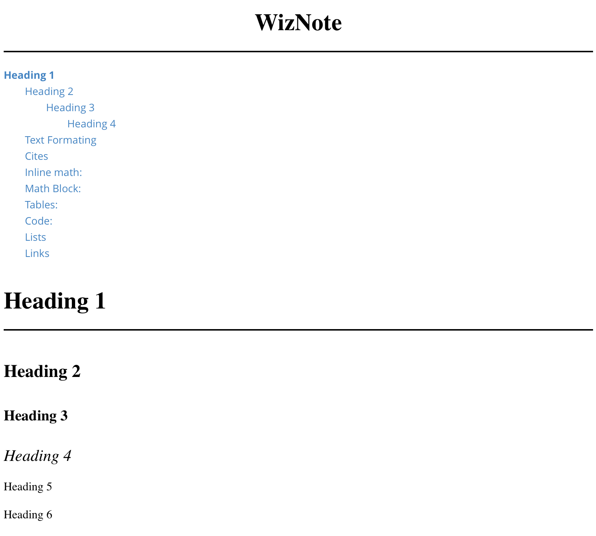
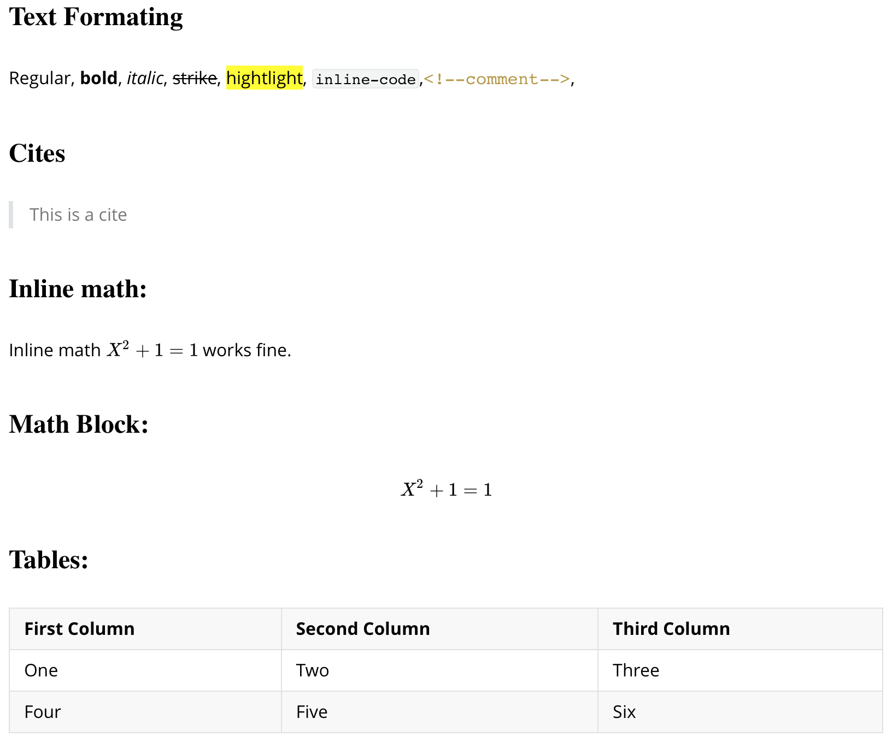
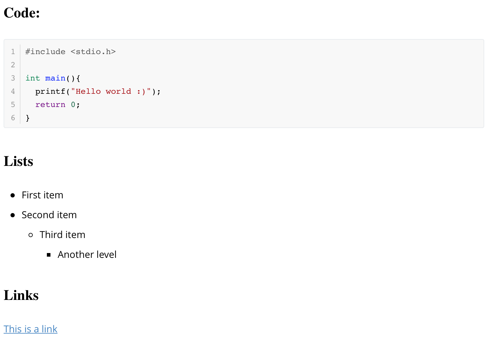

# Typora-WizNote-Theme

WizNote is a typora theme, which is a varient of Github theme with better fonts and nicer margin.

## Preview

WizNote

## Usage

Your can download it [here](https://github.com/TooSchoolForCool/Typora-WizNote-Theme/releases). Uncompress, then copy the folder `wiznote` and the file `wiznote.css` to your typora theme folder, then restart the app. 